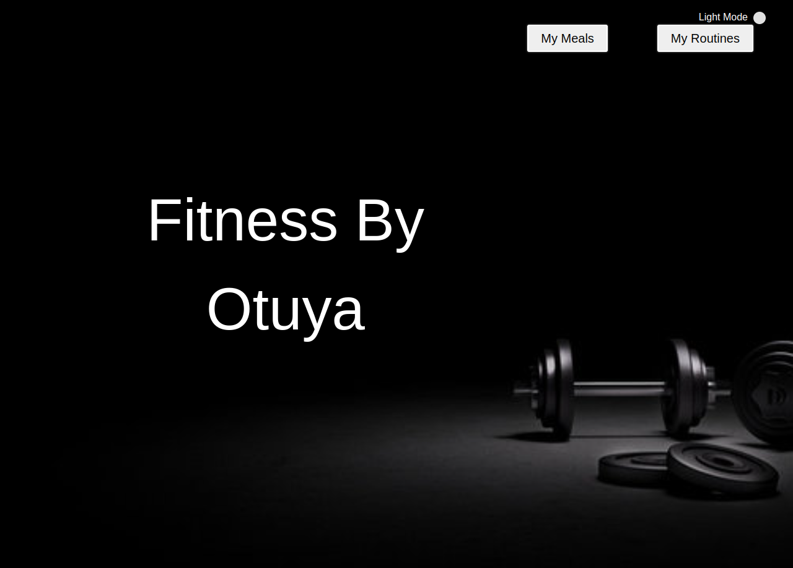
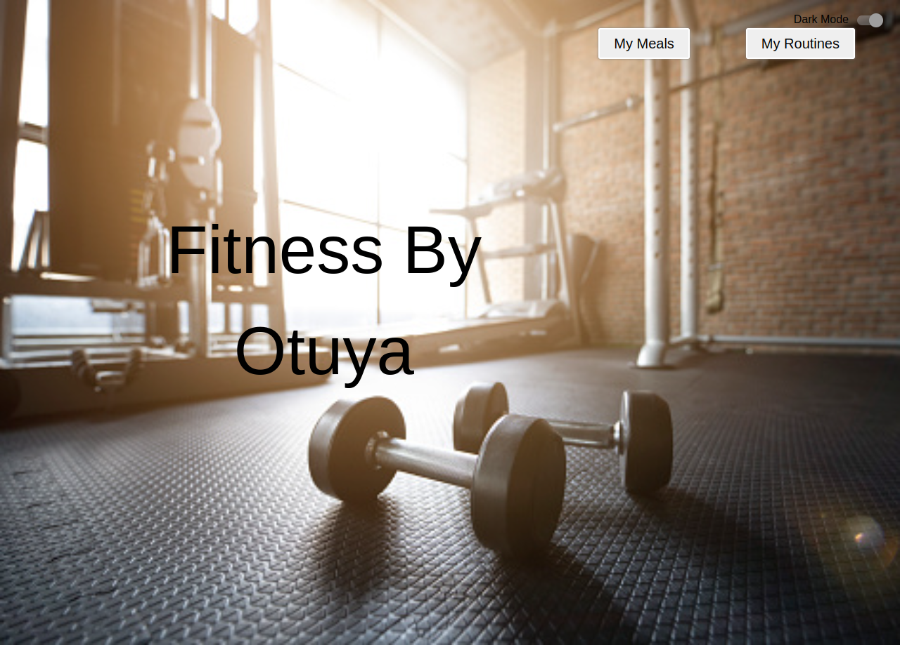

# FItness by Otuya 
This is the front ent bit of an Application that allows the user to keep track of there routines and meals for optimum fitness. 

This project was bootstrapped with [Create React App](https://github.com/facebook/create-react-app).

## Project Status
This project is currently under development.

### Project Screen Shot (UI)
* Dark Mode UI


* Light Mode UI



### Installation ansd Setup Instructions

Clone down this repository. You will need `node` and `npm` installed globally on your machine.  

Installation:
``` bash
# Install dependencies

npm install 

# To Start Server:

npm start 
``` 

To Visit App:

## Known Bugs
There are no known bugs as of now.

## Technologies Used
* HTML- to build the structure of the page
* CSS- to style the the pages
* Reactjs Library- to create the app
* Materialui
* Bootstrap
* API  - fetches data from the backed -https://github.com/Otuyanyangayi/FitnessbyOtuya-backend

### Reflection 
This was a 1 week long project built during my Third module at Moringa School of Software Development. Project goals included using technologies learned up until this point and familiarizing myself with documentation for new features.

 I started this process by using the `create-react-app` boilerplate, then adding `Materialui` and `bootstrap`.

## Support and contact details
Contact me via gracenyangayi@gmail.com